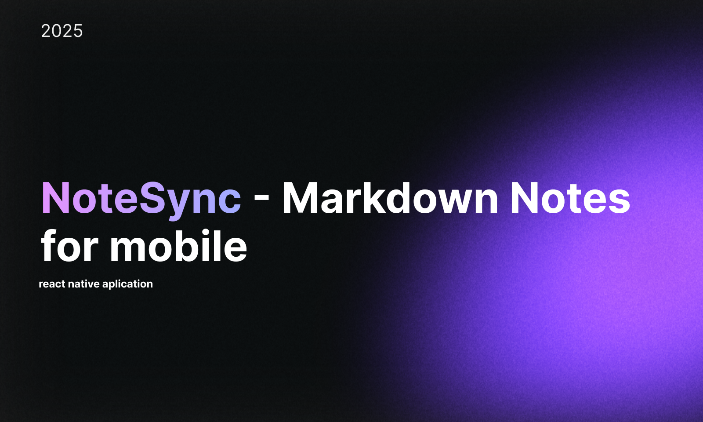

  

 
 
 

# 📱 NoteSync — Markdown Notes for Mobile

**NoteSync** é um aplicativo de anotações em Markdown, desenvolvido nativamente para dispositivos móveis. O projeto surge da necessidade de uma solução eficiente, rápida e com experiência verdadeiramente pensada para o mobile — algo que soluções atuais como **Notion** e **Obsidian** não conseguem oferecer de forma plena.

Este app combina a simplicidade e poder do Markdown com recursos modernos, como suporte a mídia, sincronização na nuvem e acesso offline, tudo isso aliado a uma interface projetada exclusivamente para smartphones.

 
 

## 🖼️ Design e Prototipação

O design do **NoteSync** foi desenvolvido com uma abordagem mobile-first desde o início, priorizando a experiência nativa, leve e fluida em dispositivos móveis.

Ao contrário de soluções como Notion e Obsidian  que foram originalmente pensadas para desktop e apenas adaptadas para smartphones, nosso projeto nasce com foco total no contexto de mobilidade. Cada detalhe da interface, fluxo e interação foi cuidadosamente planejado para atender as necessidades reais dos usuários que dependem do celular para capturar, organizar e acessar informações rapidamente.

**Figma:** [Acessar Protótipo](https://www.figma.com/) 

 
 

## 💡 Funcionalidades (MVP)

 

| Funcionalidade                       | Status                |
| ------------------------------------ | --------------------- |
| Editor Markdown com preview          | 🛠️ Em desenvolvimento |
| Criação de notas de áudio e texto    | 🛠️ Em desenvolvimento |
| Transcrição de áudio para texto      | 🛠️ Em desenvolvimento |
| Organização por pastas e tags        | 🛠️ Em desenvolvimento |
| Armazenamento local                  | 🛠️ Em desenvolvimento |
| Exportação de notas para Notion/Obsidian  | 🛠️ Em desenvolvimento |
| Exportação em pdf e docs             | 🛠️ Em desenvolvimento |
| Sincronização na nuvem               | 🛠️ Em desenvolvimento |
| Upload de imagens e áudio            | 🛠️ Em desenvolvimento |
| Modo offline robusto                 | 🛠️ Em desenvolvimento |
| Temas (Claro e Escuro)               | 🛠️ Em desenvolvimento |

 

## 📱 Capturas de Tela

### Em andamento 

  
  

## 📦 Instalação Local

### Em andamento 
